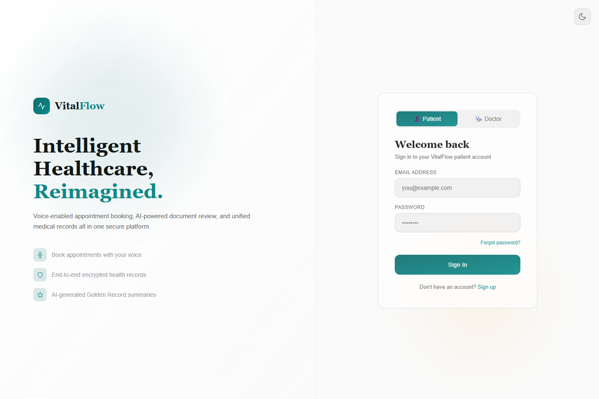
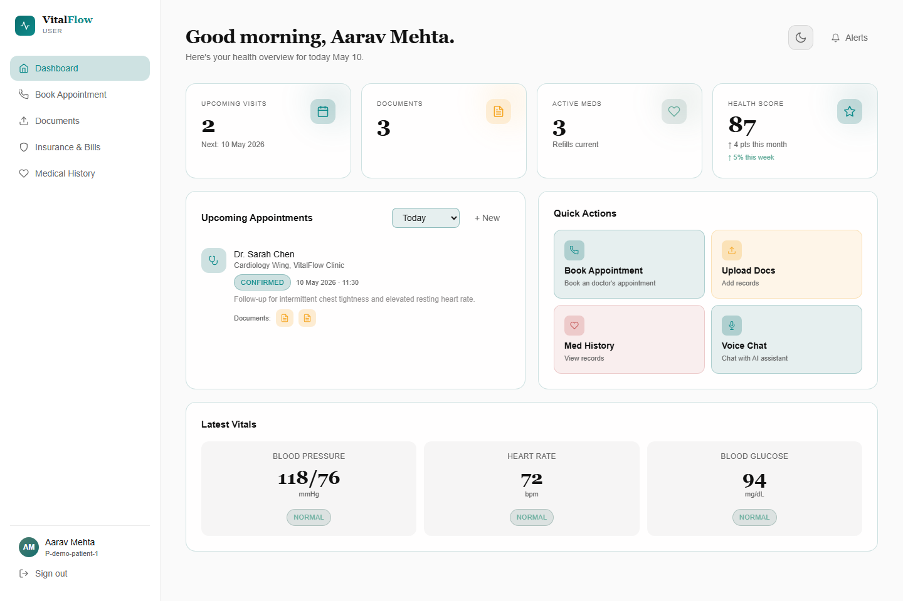
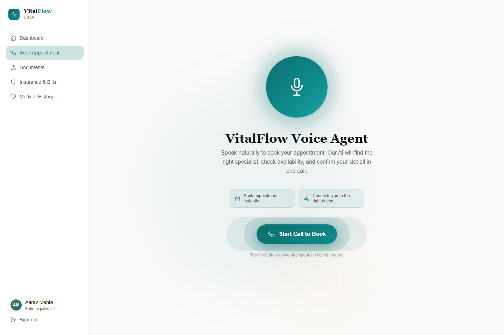
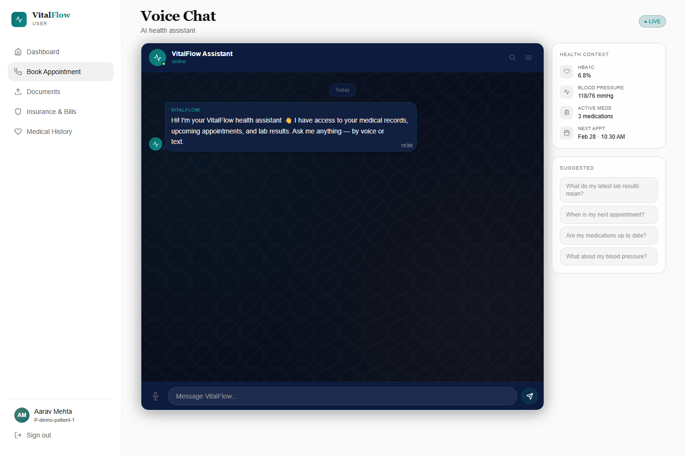
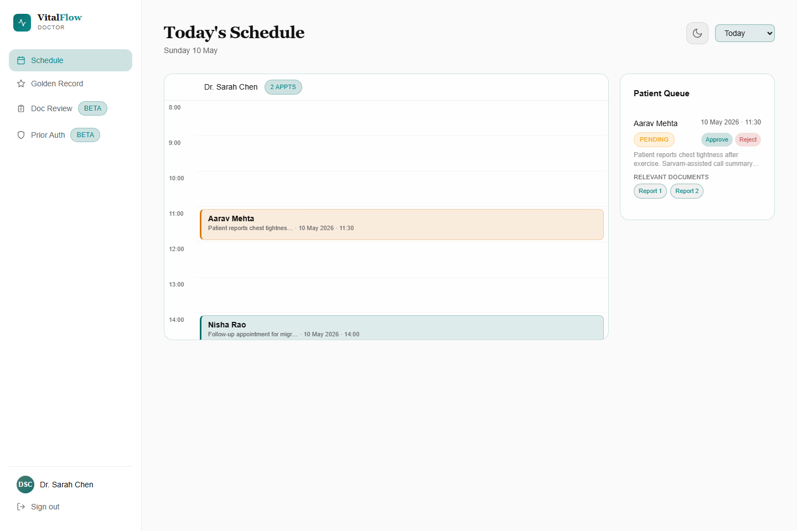

# VitalFlow Frontend

VitalFlow is a healthcare product UI for patients and doctors. The frontend gives patients a voice-first way to book appointments, chat with an AI assistant, upload medical and insurance documents, and view medical history. Doctors get schedule management, appointment approval/rejection, and AI-generated patient context through a Golden Record view.

Demo video: [VitalFlow walkthrough](https://www.youtube.com/watch?v=akoh6J3vQzY)

## Screenshots

The screenshots below use sample demo data so reviewers can understand the core VitalFlow flows without running the app locally.

### Authentication



### Patient Dashboard



### Voice Appointment Booking



### AI Voice Chat



### Doctor Schedule



## What This Frontend Does

- Patient and doctor authentication flows.
- Patient dashboard with appointment and document summaries.
- Voice-based appointment booking using LiveKit.
- AI voice chat with text and audio input.
- Medical document upload and document list views.
- Insurance document upload flow.
- Patient medical history timeline.
- Doctor schedule view with pending appointment cards.
- Doctor approve/reject flow for linked patient appointments.
- Golden Record view for AI-synthesized patient summaries.
- Responsive dark healthcare UI with custom cards, badges, sidebars, chat bubbles, call screens, and animated voice states.

## Product Areas

### Patient Experience

- `/` - Patient home dashboard.
- `/booking` - LiveKit-powered voice agent for appointment booking.
- `/chat` - AI assistant with text and recorded voice messages.
- `/documents` - Medical document upload and recent documents.
- `/insurance` - Insurance document management.
- `/history` - Aggregated patient medical history.

### Doctor Experience

- `/` - Doctor schedule and appointment queue.
- `/golden` - Golden Record for clinical review.
- `/docreview` - Document review placeholder.
- `/priorauth` - Prior authorization placeholder.

## Tech Stack

- React 19
- Vite
- Tailwind CSS
- React Router
- LiveKit React components
- LiveKit client
- React Markdown
- Custom component system for buttons, badges, cards, layout, chat, and metrics

## Key Frontend Flows

### Voice Appointment Booking

The `VoiceAgent` page connects to a LiveKit room through a backend-generated token. It renders an in-call interface with:

- Start-call screen
- Live audio renderer
- AI speaking/listening state
- Doctor result panel
- Mobile bottom sheet for doctor results
- Desktop side panel for doctor results
- Appointment selection messages sent back through LiveKit chat

### AI Voice Chat

The `VoiceChat` page supports both text and microphone input:

- Records audio in the browser using `MediaRecorder`.
- Sends audio or text to the backend `/talk` endpoint.
- Renders returned chat history.
- Plays backend-generated TTS audio responses.
- Displays related medical documents returned from RAG.

### Doctor Schedule

The doctor schedule loads doctor slots from the backend and lets doctors:

- Review patient appointment requests.
- See related documents attached to the appointment.
- Approve or reject appointments.
- Sync appointment status back to the patient.

## Environment Variables

Create a `.env` file:

```env
VITE_API_BASE_URL=http://localhost:3000/api
```

Use your deployed backend URL in production.

## Run Locally

```bash
npm install
npm run dev
```

Build for production:

```bash
npm run build
```

Preview production build:

```bash
npm run preview
```

## Demo Assets

- Main demo video: [YouTube](https://www.youtube.com/watch?v=akoh6J3vQzY)
- Local project-level demo files may exist in the parent workspace, but the README intentionally links to YouTube so the repository stays lightweight.

## Backend Pair

This frontend expects the VitalFlow backend to provide:

- Auth APIs for users and doctors.
- `/talk` for text/audio AI chat.
- `/get-token/:userId` for LiveKit access tokens.
- User document upload and history APIs.
- Doctor slot and appointment approval APIs.
- Golden Record APIs.
